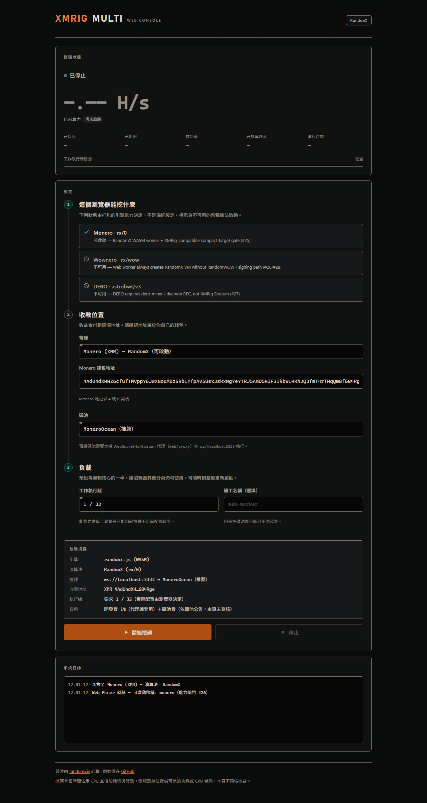
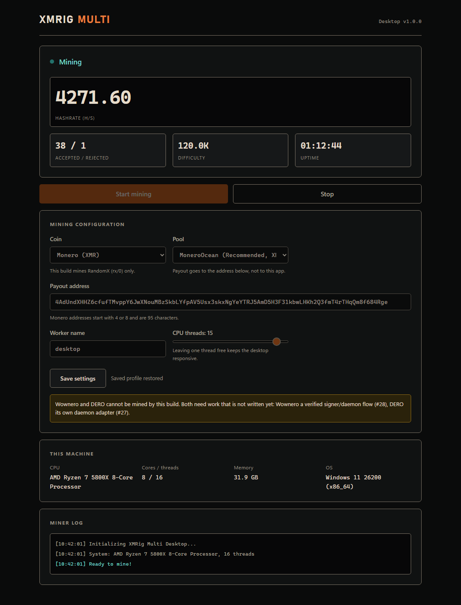

# Screenshots

Captures for contributors and reviewers.

The Android set below is from real hardware: a Samsung Galaxy S21+ (SM-G9960, Android 15,
arm64-v8a) against `gulf.moneroocean.stream:10128`. The Web and Desktop sets are headless
Chromium renders of the shipped markup at fixed viewport widths — accurate for layout, type and
colour, but not proof that a miner ran.

## Android

| Shot | File | What it shows |
|------|------|----------------|
| Home (idle) | [android/01-home-idle.png](android/01-home-idle.png) | Stopped state, start/stop controls, ARM64 CPU info |
| Config / pool | [android/02-config-pool.png](android/02-config-pool.png) | Coin + MoneroOcean pool; TLS switch (fingerprint trust when `#134` binary matches `native-capabilities.json`) |
| Config / settings | [android/03-config-settings.png](android/03-config-settings.png) | Wallet, worker name, threads / CPU target, Save |
| Mining | [android/04-mining-running.png](android/04-mining-running.png) | Live hashrate (~500 H/s), difficulty, temp, CPU |
| Statistics | [android/05-stats.png](android/05-stats.png) | 10s/60s hashrate, shares, device health |
| After stop | [android/06-after-stop.png](android/06-after-stop.png) | UI returned to stopped after Stop Mining |

### Preview

> The Android shots above predate the Kiln design system and are queued for a re-capture on the
> same device.

## Web

Headless Chromium, `web/index.html`.

| Shot | File | What it shows |
|------|------|----------------|
| Setup, ready to start | [web/01-setup-ready.png](web/01-setup-ready.png) | 1280px. Three-step flow, capability list marking WOW/DERO unavailable, launch summary, and the idle readout showing `–` rather than zeros |
| Mining, narrow | [web/02-mining-mobile.png](web/02-mining-mobile.png) | 390px. Single-column layout with the hero hashrate, share ledger and worker-activity indicator |

## Desktop

Headless Chromium, `desktop/index.html`, hydrated with representative values (the real page needs
the Tauri runtime).

| Shot | File | What it shows |
|------|------|----------------|
| Mining | [desktop/01-mining.png](desktop/01-mining.png) | 1100px. Readout, controls, configuration and machine report in one window |
| Idle, narrow | [desktop/02-idle-narrow.png](desktop/02-idle-narrow.png) | 760px. Placeholders in place of fabricated zeros; standing capability limits stated next to the coin picker |

