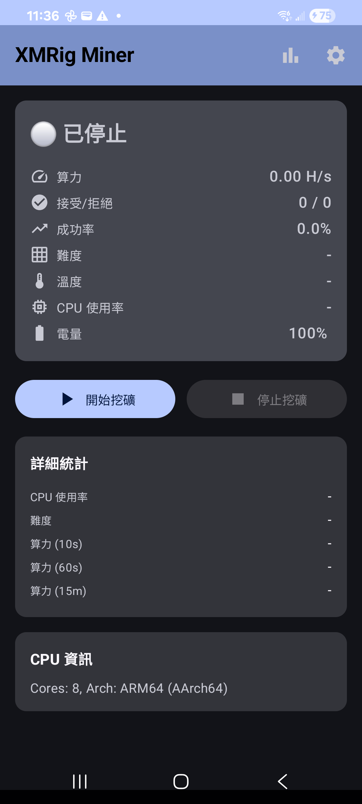
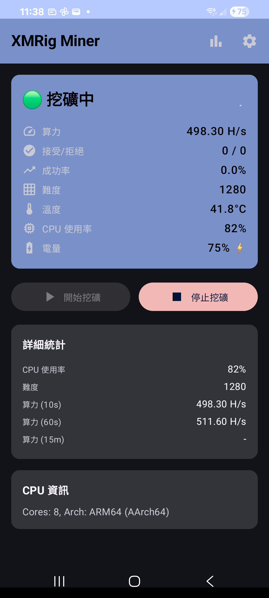
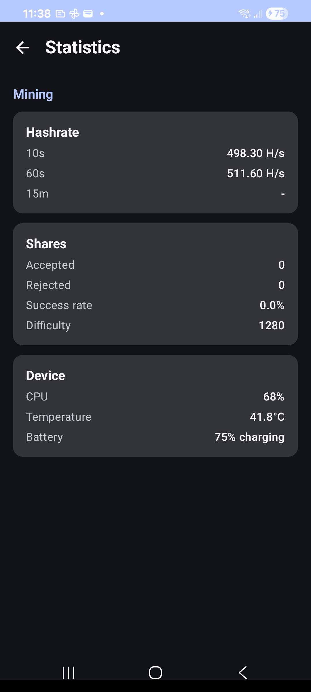

# Screenshots

Device captures for contributors and reviewers. Taken on a Samsung Galaxy S21+ (SM-G9960, Android 15, arm64-v8a) against `gulf.moneroocean.stream:10128`.

## Android

| Shot | File | What it shows |
|------|------|----------------|
| Home (idle) | [android/01-home-idle.png](android/01-home-idle.png) | Stopped state, start/stop controls, ARM64 CPU info |
| Config / pool | [android/02-config-pool.png](android/02-config-pool.png) | Coin + MoneroOcean pool; TLS switch disabled (`WITH_TLS=OFF`) |
| Config / settings | [android/03-config-settings.png](android/03-config-settings.png) | Wallet, worker name, threads / CPU target, Save |
| Mining | [android/04-mining-running.png](android/04-mining-running.png) | Live hashrate (~500 H/s), difficulty, temp, CPU |
| Statistics | [android/05-stats.png](android/05-stats.png) | 10s/60s hashrate, shares, device health |
| After stop | [android/06-after-stop.png](android/06-after-stop.png) | UI returned to stopped after Stop Mining |

### Preview

